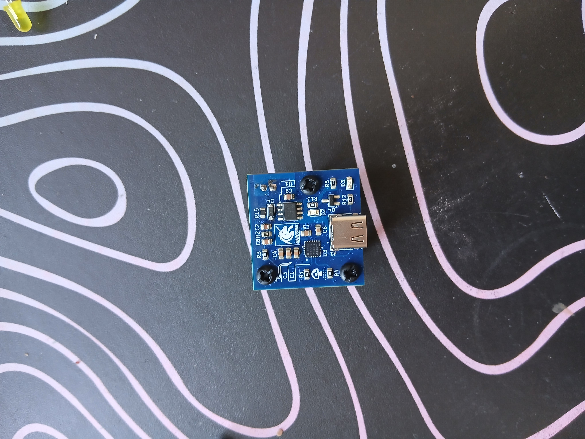
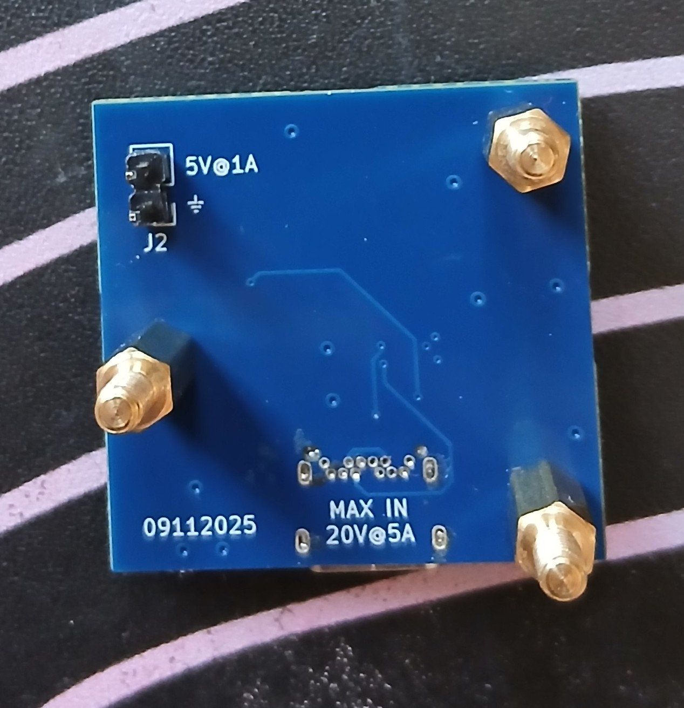

# Power Supply

The purpose of this module is to provide 5V@1A. The power negotiation is managed by the CYPD3177, which negotiates the power over the CC lines and triggers an alert if the negotiation for the selected power scenario fails.

The module features a load switch made of two back-to-back PMOS transistors, soft start, and inductive kickback protection.

## Improvement: 
To improve the modular USB power supply, a switchable display showing power consumption could be implemented, as well as means for remote power monitoring purposes over some digital protocol.

## Front Side 

## Back Side
