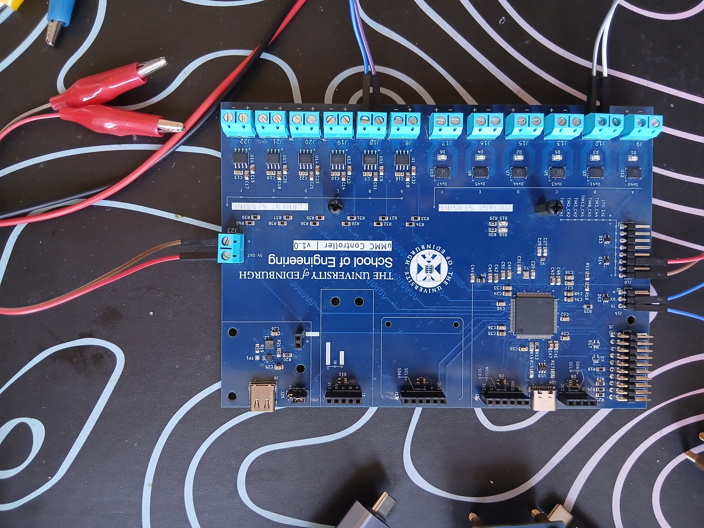
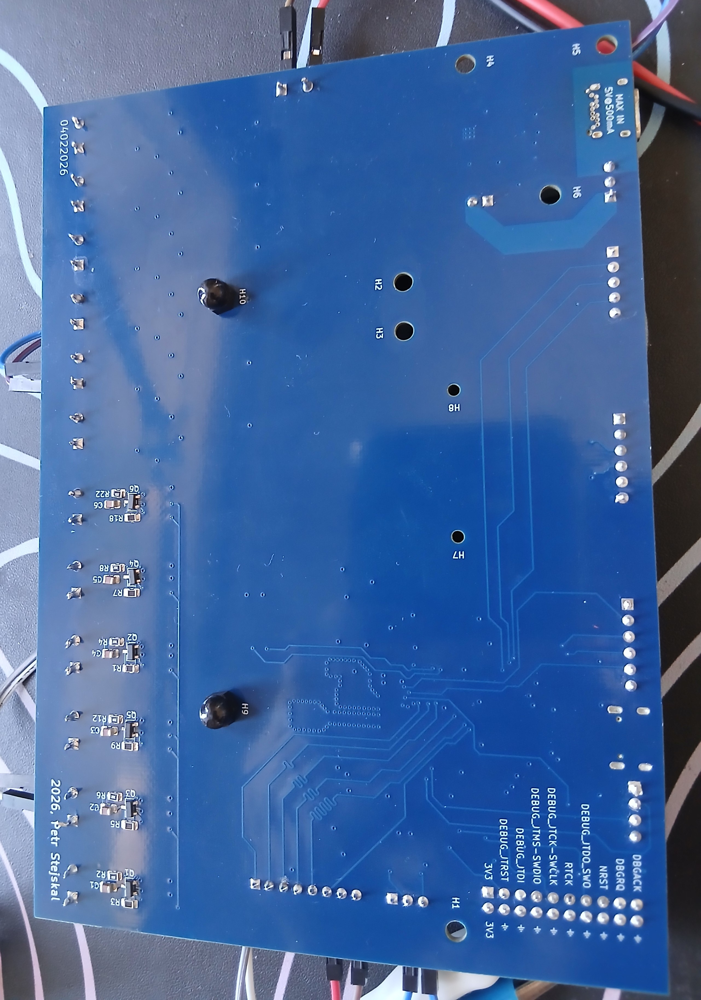

# Laboratory MMC controller
The purpose of the controller is to drive series-connected stack topologies. This is achieved through a UART data connection, which is responsible for communicating variables such as the modulation index and submodule ID.

To achieve accurate switching, the submodules must be capable of real-time synchronisation and local generation of synchronous triangular carrier waveforms and sinusoidal modulation waveforms.

While the triangular carrier waveform is synchronised and common to all submodules, the modulation waveform has different amplitudes for each submodule. These amplitude offsets are calculated on the controller board and propagated through the UART data connection.

## Time Synchronisation  

### Time-Tuning Algorithm  

The time synchronisation can be achieved simply by propagating the reference time through the stack over UART. These times can then be compared on the controller, and the propagation delays can be compensated for.

### Synchronisation Signal  

Alternatively, for a simple implementation and high accuracy, the submodules can feature a synchronisation pin that would start the time, for example, on logic high.

## Initialisation

The stack is expected to be initialised by running firmware on the submodules that firstly passes the data sent down the chain, and secondly iterates a variable that counts the submodules.

Based on the number of submodules and symmetry of the arms, the number of modules per arm is obtained by division of two.

The offset values of the modulation index are then calculated based on the number of submodules present in the upper and lower arm. These offsets are then distributed over UART to each of the submodules.

## Front Side 

## Back Side
