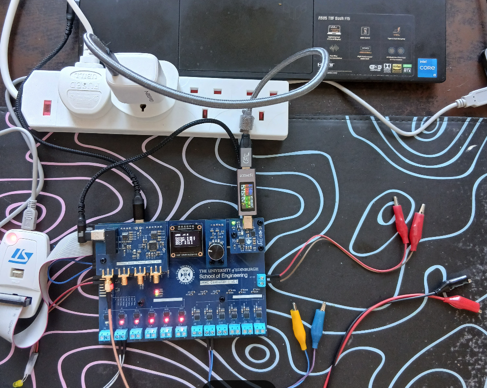

# Laboratory MMC controller

This system drives series-connected stack topologies. The core of the system is the controller board that implements STM32 for flow control and data processing. The board provides local and remote HMI, monitoring points for voltage and current, and additional functions such as PWM channels or a power supply terminal.

The system provides extended functionality through additional shields, such as a data acquisition shield for producing or reconstructing digital signals, a power supply board, and an encoder and display for local user input.

Functions: 
- Submodule UART Link 
- USB Data Link
- Voltage Monitoring 
- Current Monitoring 

Additional Functions: 
- PWM Channels
- 5V/3V3 Power Sources

PCB Shields:
- Data Acquisition (signal viewer)
- Power Supply (power booster)
- Encoder
- Display

## Ideal Laboratory Submodule

For the controller to be able to efficiently drive the submodules, the submodules need to implement a full-duplex UART communication protocol and accurate time metering. The time synchronization setting is essential for effective functioning and should be optimized by algorithmic sweeps through the stack. However, for simplicity and versatility, it is recommended to implement a synchronization input, giving an extra synchronization option, for example, for debugging purposes.

The submodules should be autonomous and function as decentralized units, implementing functions such as current and voltage metering on board, local capacitor management on board, and the submodule algorithm to define the stack behaviour, describing functions such as data propagation, frequency adjustment, scheduled events, and fault handling.

### Minimal Submodule Design

The minimal submodule design establishes the conversion features only: an MCU with half-bridge or full-bridge capabilities and a capacitor on board that connects over UART and synchronizes over an external pin. The capacitors can then be directly charged from the controller board, leaving out all the complex control problems.

## Simple System Architecture

## PCB Assembly

## Detailed System Architecture

## Real System View

## Model System View
